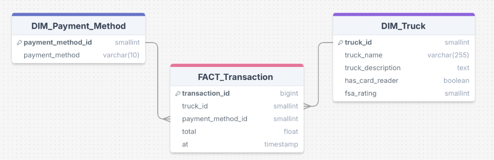

# Tasty Truck Treats (T3) Data Pipeline Project
## Overview
Tasty Truck Treats (T3) is a catering company operating a fleet of food trucks in Lichfield and its surrounding areas. Each truck offers a unique menu, delivering a wide variety of culinary experiences to customers. T3 aims to improve its business operations by using data to refine menus, enhance marketing strategies, and optimize fleet management.

This project involves creating an automated ETL (Extract, Transform, Load) pipeline to collect and analyze transaction-level data from all food trucks. Insights gained from the data will be used for making informed decisions on truck performance and customer preferences.

## Project Structure
This project is split into two main parts, based on the work done over two weeks:

# 1. Historical Data Pipeline
This part focuses on creating a simplified version of the data pipeline using historical data. The pipeline will be triggered manually, and the raw data will be processed and stored in a cloud data warehouse. A dashboard will read from the data warehouse to provide analysis.

The pipeline:


Key tasks:
- Extract data from an S3 bucket containing historical truck transaction data.
- Transform the raw data by cleaning and aggregating it.
- Load the cleaned data into a Redshift database.
- Build a dashboard with Streamlit to visualize the data for non-technical users.

Key Tools & Technologies:
- **Python Libraries:** `Pandas`, `Altair` (data cleaning, transformation, and visualization)
- **AWS Resources:**
 - `S3 Bucket`: Storage for historical truck data
 - `Redshift`: Data warehouse for storing cleaned data
 - `Elastic Container Registry (ECR)`: Stores Docker images for deployment
 - `Elastic Container Service (ECS) Fargate`: Deploys the dashboard
 - `ECS Task Definition`: Links Docker image to ECS service
- **Data Modeling:** `Star Schema`
- **Visualization:** `Jupyter Notebook` for exploration, `Streamlit` for interactive dashboard
- **Containerization:** `Docker`

# 2. Live Data Pipeline
Building on the historical pipeline, this part of the project adapts the pipeline to pull in current transaction data and incorporates a reporting step. The pipeline will be scheduled to run regularly, ensuring that the dashboard always has the most up-to-date data. Every morning, a summary report is automatically emailed to the CEO. The whole project will be hosted on the cloud.

The pipeline(Not EC2):


Key tasks:
- Scheduled the extraction of live transaction data from the S3 bucket.
- Clean and transform the data, then upload it to the database.
- Generate daily email reports summarizing key metrics.


Key Tools & Technologies:
- **Python Libraries:** `Pandas`
- **AWS Resources:**
 - `S3 Bucket`: Stores live transaction data
 - `EventBridge`: Schedules and triggers the ETL pipeline
 - `Lambda`: Runs the ETL tasks and generates reports
 - `Simple Email Service (SES)`: Sends the daily email reports with visualizations
 - `Step Functions`: Manages the Lambda and SES workflow
- **Containerization:** `Docker`
- **Automation:** `Terraform` for provisioning AWS resources

## Folder Structure
**historical_data_pipeline**
Contains all files related to the historical data pipeline, including:

- `etl.py`, `extract.py`, `load.py`, and `transform.py` for managing the ETL workflow.
- `dockerfile` for containerizing the pipeline.
- `schema.sql` for database setup.
- `truck_analysis.ipynb` for initial data exploration.
- `dashboard folder` which contains the Streamlit dashboard files for visualizing the data and files necessary for containerizing the dashboard
- `requirements.txt` for Python dependencies.

**live_data_pipeline**
Contains all files related to the live data pipeline, including:

- `etl.py`, `extract.py`, `load.py`, and `transform.py` for the live data ETL workflow.
- `dockerfile` for re-dockerizing the updated pipeline.
- `terraform` configuration files for automating the AWS resource creation.
- `lambda folder` with necessary files to run Lambda functions for report generation and database access.
- `requirements.txt` for Python dependencies.

## Setup Instructions

1. Clone the Repository
Clone this repository to your local machine:
```git clone https://github.com/your-username/tasty-truck-treats.git```

2. Set-up Virtual Environment
```python3 -m venv .venv```
```source .venv/bin/activate```

3. Install Dependencies
Install the required Python dependencies by running:
```pip3 install -r requirements.txt```

For the dashboard:
```pip install -r dashboard/requirements.txt```

4. Setting Up AWS Resources
Run the following commands from the `live_data_pipeline` folder to set up the necessary AWS resources:
```terraform init```
```terraform apply```

5. Run the Historical Data Pipeline
To run the historical data pipeline:
```python historical_data_pipeline/etl.py```

6. Run the Live Data Pipeline
To run the live data pipeline, ensure the scheduled tasks and AWS Lambda functions are set up through EventBridge and Terraform. You can manually trigger the pipeline as needed:
```python live_data_pipeline/etl.py```

7. Launch the Dashboard
You can run the Streamlit dashboard locally with the following command:
```streamlit run dashboard/streamlit.py```

8. Check Reports
The system will automatically send daily summary reports to the T3 CEO using SES.

## Additional Information
Both the historical_data_pipeline and live_data_pipeline folders have their own `README.md` files for more detailed explanations on their respective setup and functions.


**Data Model: Star Schema**


**Streamlit Dashboard Wireframe**
