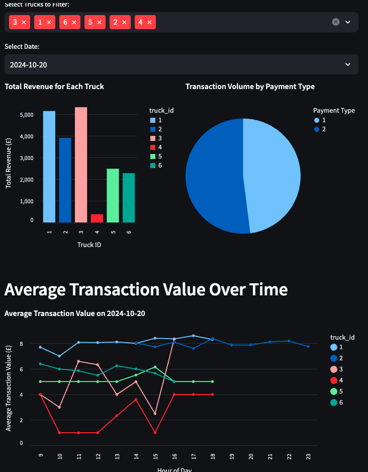

# Dashboard

This folder should contain all code and resources required for the dashboard.

**Dashboard for Hiram**

**Dashboard Wireframe**

Visualizations:
- **Total Revenue per Truck:** A bar chart showing each truck’s total revenue. This shows how much each truck is earning over time, helping to identify top and underperforming trucks.
- **Average Transaction Value:** A line chart with the average transaction per truck or over time. Monitoring this can help in assessing spending patterns and adjusting pricing strategies if needed.
- **Transaction Volume by Payment Type:** A pie chart or bar chart breaking down transactions by cash vs card. A breakdown of cash vs. card transactions, which can be helpful for understanding customer preferences and evaluating card reader utility.

**Filterable Insights:** Options to filter by date, truck, or payment type, allowing the team to isolate specific insights.

## Recommendations for Hiram Boulie (Chief Financial Officer for T3)

## Recommendation 1: Optimize Cash vs. Card Payments
**Insight:** Based on the data, the proportion of cash transactions made are higher (51.37%) compared to card transactions. This could lead to additional costs and potential security risks due to the need for cash storage and transportation.

**Recommendation:** They could encourage card payments by offering discounts or rewards for card transactions. Card transactions automates and offers more accurate and efficient transactions compared to manual handling of cash transactions. This also reduces customer wait times and can improve overall consumer satisfaction.

## Recommendation 2: Analyze Low Transaction Trucks for Optimization
**Insight:** The data highlights that truck_id 4 has the lowest transaction value of 2.74, which is significantly lower than all the other trucks. This indicates that this truck is the least profitable.

**Recommendation:** Investigate underperforming trucks to understand the cause of low transaction value. 
Possible actions include reassessing routes, adjusting schedules, or replacing underutilized trucks with those that have higher transaction potential. Optimizing truck use could increase overall efficiency and reduce operational costs.

## Recommendation 3: Standardize and Monitor Transaction Totals Across Trucks
**Insight:** The analysis on average transaction values per truck varies between trucks. Trucks with ids 1 and 2 have significantly higher transaction values compared to the average (6.51), whilst the other trucks have lower transaction values than the average, with truck with id 4 being significantly lower. 

